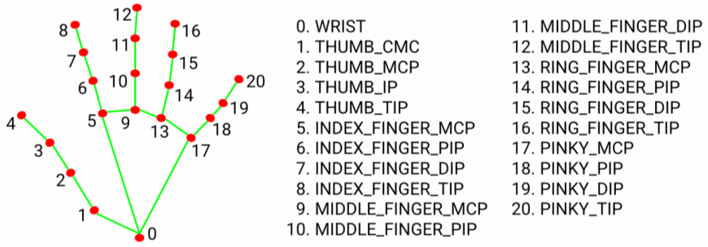

# Real-Time Hand Detection & Tracking with OpenCV & MediaPipe

This project is a Python-based solution for real-time hand detection and landmark tracking using a webcam. It leverages the **OpenCV** library for image processing and Google's powerful **MediaPipe** framework for the underlying machine learning model.

---

## Key Features

-   **Real-time Performance:** Tracks hands smoothly and efficiently directly from a live webcam feed.
-   **Multi-hand Detection:** Capable of detecting and tracking multiple hands simultaneously.
-   **21 Hand Landmark Tracking:** Identifies 21 key points (landmarks) on each hand, allowing for detailed gesture analysis.
-   **Modular Code:** Includes a reusable `handDetector` class for easy integration into other computer vision projects.
-   **FPS Counter:** Displays the current Frames Per Second (FPS) on the screen to monitor performance.

---

## Technologies Used

-   **Python 3.12**
-   **OpenCV:** Used for video capture, image manipulation, and rendering.
-   **MediaPipe:** Used for the high-fidelity hand tracking and landmark detection model.

---

## Setup and Installation

To run this project, first ensure you have Python installed on your system. Then, install the required dependencies using the `requirements.txt` file.

1.  **Clone the repository:**
    ```bash
    git clone [https://github.com/nimabgr/Hand-Detection-OpenCV-MediaPipe.git]
    cd Hand-Detection-OpenCV-MediaPipe
    ```

2.  **Create and activate a virtual environment (highly recommended):**
    ```bash
    # Create the environment
    python -m venv venv

    # Activate on Windows
    venv\Scripts\activate

    # Activate on macOS/Linux
    source venv/bin/activate
    ```

3.  **Install the required packages:**
    ```bash
    pip install -r requirements.txt
    ```

---

## How to Run

This repository contains two primary Python scripts:

1.  **`handTrackingMin.py`**:
    A minimal, straightforward script to demonstrate the core hand detection functionality. This file is perfect for understanding the basic algorithm.
    ```bash
    python handTrackingMin.py
    ```

2.  **`handTrackingModul.py`**:
    This file contains the modular `handDetector` class, designed to be easily imported and reused in other applications. Running this script directly will also launch a demonstration.
    ```bash
    python handTrackingModul.py
    ```

---

## Understanding the Hand Landmarks

The MediaPipe model identifies **21 unique landmarks** for each hand, with each point corresponding to a specific joint. The image below provides a visual map of these landmarks and their corresponding index numbers.



These landmarks are the primary output of the model. Their coordinates (x, y) can be used to build various applications like gesture control, virtual drawing, sign language recognition, and more. For example, in the code, `lmList[4]` provides the coordinates of the thumb's tip (THUMB_TIP), while `lmList[8]` provides the coordinates for the index finger's tip (INDEX_FINGER_TIP).

---

## Code Structure

-   **`handTrackingModul.py`**:
    This is the main module containing the `handDetector` class. It encapsulates all the logic for finding hands and extracting landmark positions. This approach keeps the code clean, organized, and highly reusable.

-   **`handTrackingMin.py`**:
    A basic implementation that demonstrates the detection logic without using a class structure. It serves as an excellent starting point for learning the core concepts.

---
